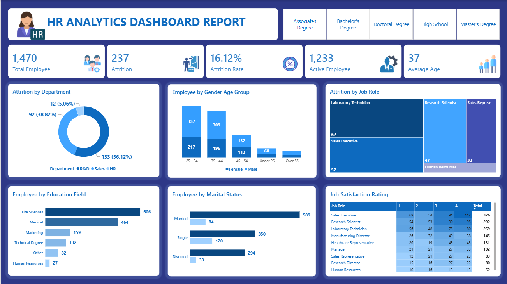

# HR Analytics Dashboard – Power BI
## Project Overview
This project is an HR Analytics Dashboard created using Microsoft Power BI.
The dashboard provides an overview of employee data and helps analyze employee attrition, demographics, education, job roles, marital status, and job satisfaction.
The main objective of this project is to convert employee data into meaningful business insights that can help HR teams understand workforce trends and attrition patterns.
## Dashboard Preview

## Tools Used
- Microsoft Power BI
- Power Query
- DAX
- Data Visualization

## Key KPIs
The dashboard displays the following key metrics:
- Total Employees: 1,470
- Attrition: 237
- Attrition Rate: 16.12%
- Active Employees: 1,233
- Average Age: 37

## Dashboard Analysis
The dashboard includes the following analysis:

### 1. Attrition by Department
Shows employee attrition across different departments such as:
- R&D
- Sales
- HR

### 2. Employee by Gender and Age Group
Shows the distribution of male and female employees across different age groups.

### 3. Attrition by Job Role
Shows attrition across different job roles and helps identify roles with higher employee exits.

### 4. Employee by Education Field
Shows employee distribution across education fields such as:
- Life Sciences
- Medical
- Marketing
- Technical Degree
- Human Resources
- Other

### 5. Employee by Marital Status
Shows employee distribution based on marital status:
- Married
- Single
- Divorced

### 6. Job Satisfaction Rating
Shows job satisfaction ratings by different job roles.

## Key Business Questions
This dashboard helps answer questions such as:
- What is the overall employee attrition rate?
- Which department has higher attrition?
- Which job roles have higher attrition?
- How are employees distributed across different age groups?
- What are the major employee education fields?
- How are employees distributed by marital status?
- How does job satisfaction vary across job roles?

## Project Outcome
This project demonstrates my ability to:
- Analyze HR-related data
- Create KPIs using Power BI
- Build interactive dashboards
- Use Power Query for data preparation
- Create business-focused visualizations
- Identify patterns and trends from employee data
- Present data in a clear and understandable format

## Author

Nishi Kumari Yadav
